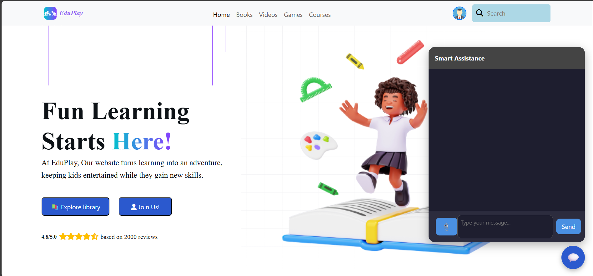
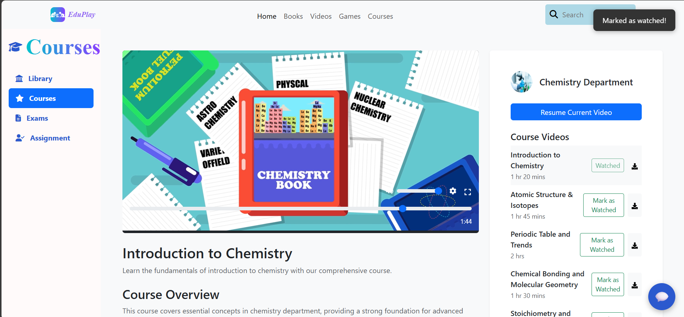
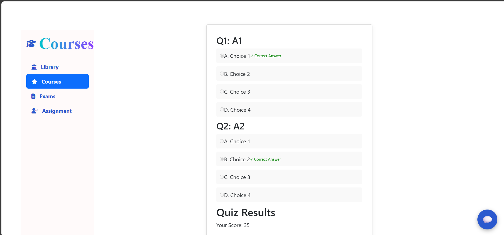
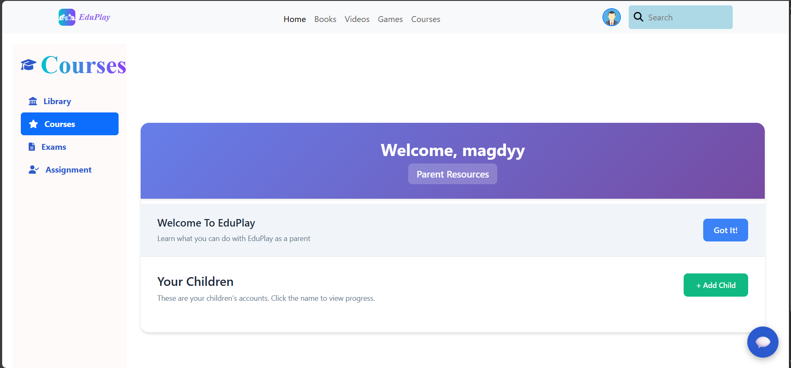

# EduPlay


## Overview

EduPlay is a full-stack educational platform designed for children, parents, and organizers. It provides interactive courses, video learning, PDF library, games, assignments, dashboards, and a chat assistant powered by AI. The platform aims to make learning engaging and accessible for all users.

## Features

- **User Roles:** Child, Parent, Organizer
- **Authentication:** Secure login and registration
- **Courses:** Browse, enroll, and track progress in various subjects (Math, Chemistry, Physics, Computer Science, English, Social Science)
- **Video Learning:** Watch educational videos for each course chapter
- **PDF Library:** Access and read educational PDFs
- **Games:** Interactive games for children
- **Assignments & Exams:** Take assignments and exams, with results tracking
- **Dashboards:** Personalized dashboards for parents and children
- **Chat Assistant:** AI-powered chat for Q&A and support
- **Admin Tools:** Course and exam management for organizers

## Tech Stack

- **Frontend:** React, Tailwind CSS, Bootstrap, FontAwesome, React Router
- **Backend:** Node.js (Express), Python (Flask for AI/chat)
- **Database:** MongoDB
- **Other:** Cloudinary (media), Multer (uploads), JWT (auth), Figma (UI design)

## Project Structure

- `src/` - React frontend components and pages
- `backend/` - Node.js backend (API, models, routes, controllers)
- `public/` - Static assets (images, videos, PDFs)
- `database/` - Seed data (JSON)
- `screenshots/` - UI screenshots for documentation

## Screenshots

| Home Page | Course Page | Games Learning | Exam Page | Dashboard |
|-----------|-------------|----------------|-----------|-----------|
|  |  |  |  |  |

## Figma Design

[View the Figma UI Design](https://www.figma.com/design/DVca1L4CYkgBWtjYm36BDB/Graduation-Project?node-id=14-3906&p=f)

## Getting Started

### Prerequisites
- Node.js & npm
- Python (for AI/chat backend)
- MongoDB

### Installation
1. Clone the repository:
	```bash
	git clone https://github.com/ahmad1adel/EduPlay.git
	cd eduplay
	```
2. Install frontend dependencies:
	```bash
	npm install
	```
3. Install backend dependencies:
	```bash
	cd backend
	npm install
	```
4. (Optional) Set up Python backend for AI/chat:
	```bash
	pip install -r requirements.txt
	```
5. Configure environment variables (see `.env.example`)

### Running the App
1. Start MongoDB
2. Start backend server:
	```bash
	cd backend
	npm start
	```
3. Start frontend:
	```bash
	npm start
	```
4. (Optional) Start Python AI/chat server:
	```bash
	python app.py
	```

## Contributing

Pull requests are welcome! For major changes, please open an issue first to discuss what you would like to change.

## License

This project is licensed under the MIT License.

---
